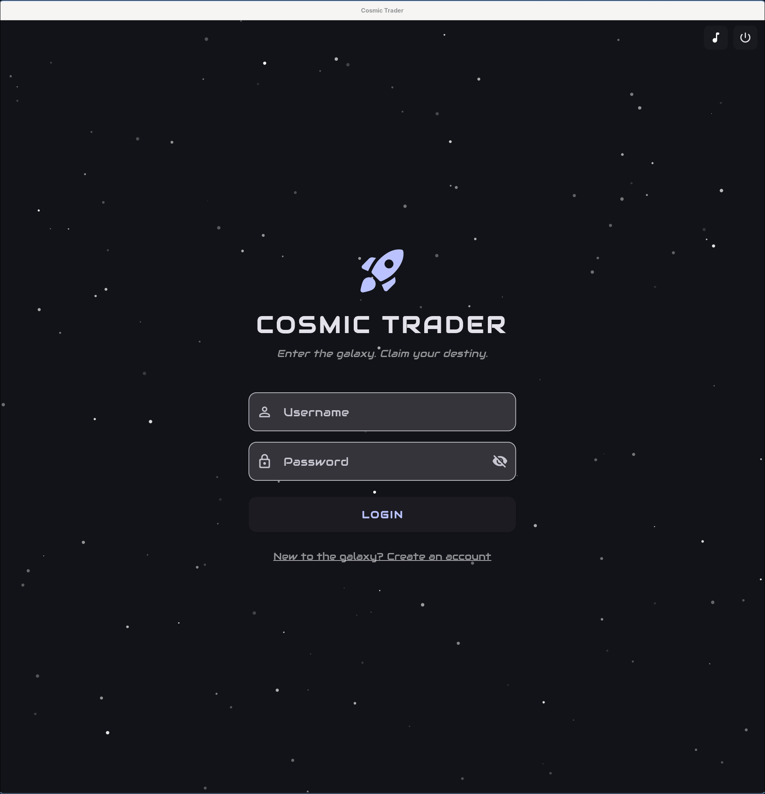
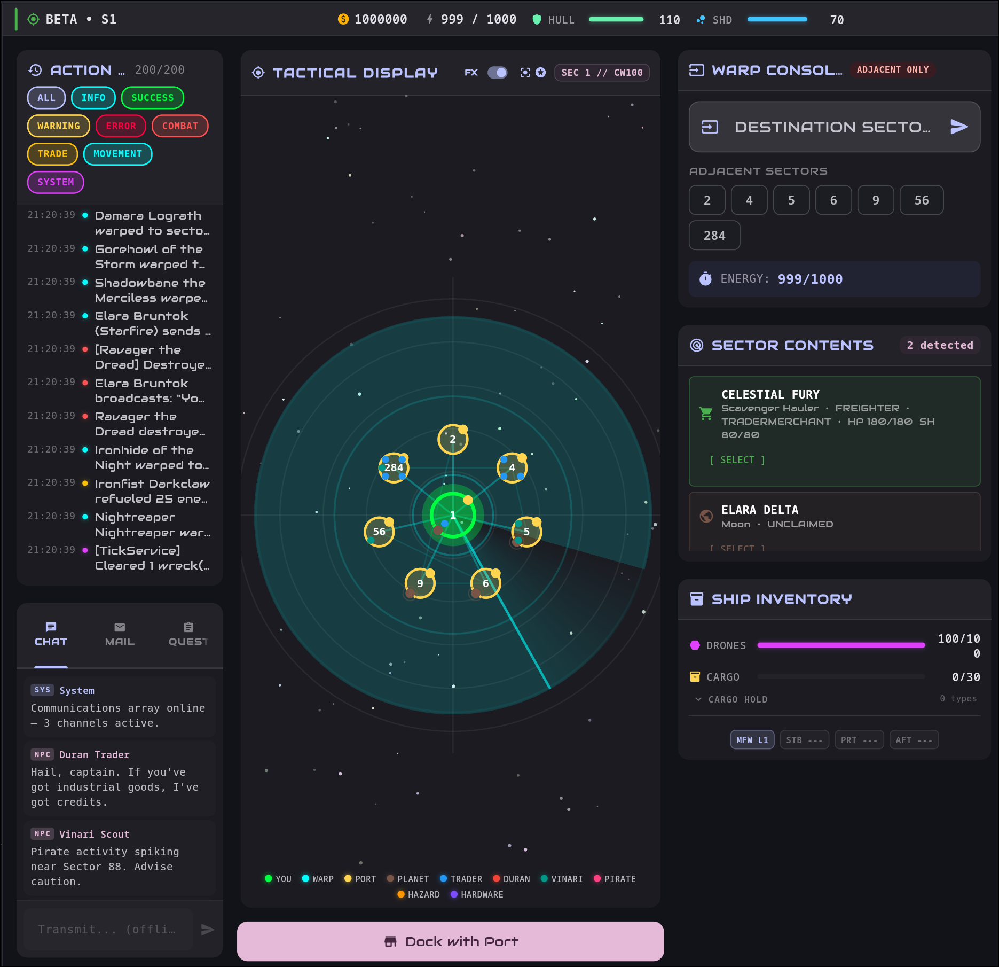
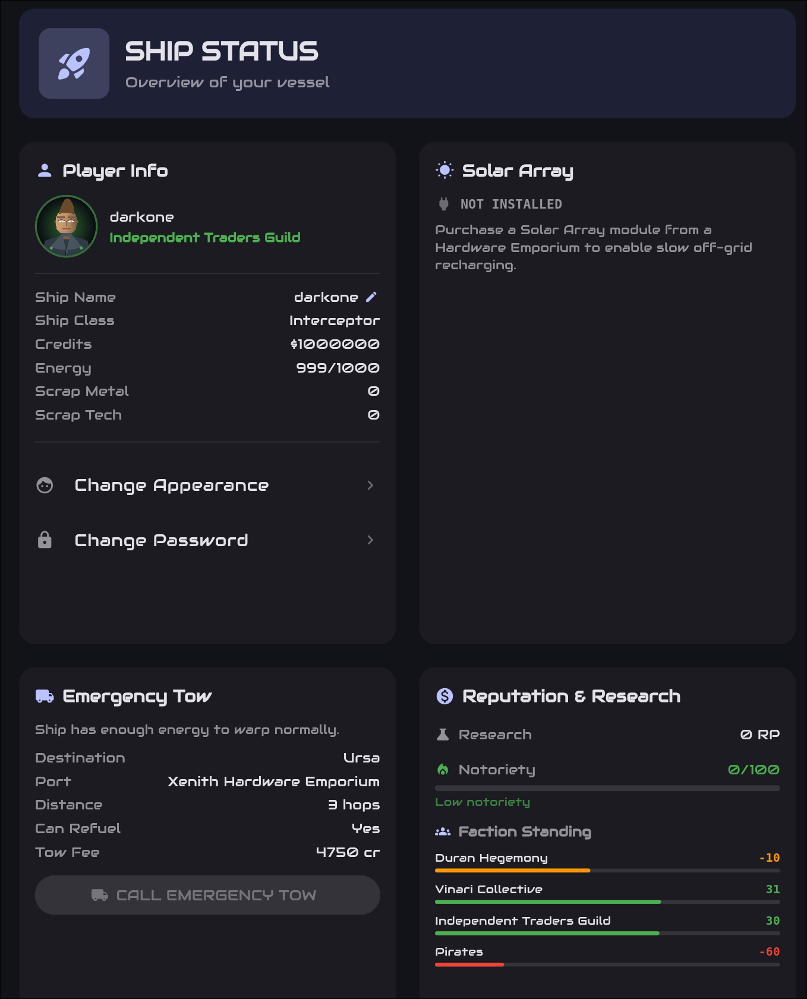
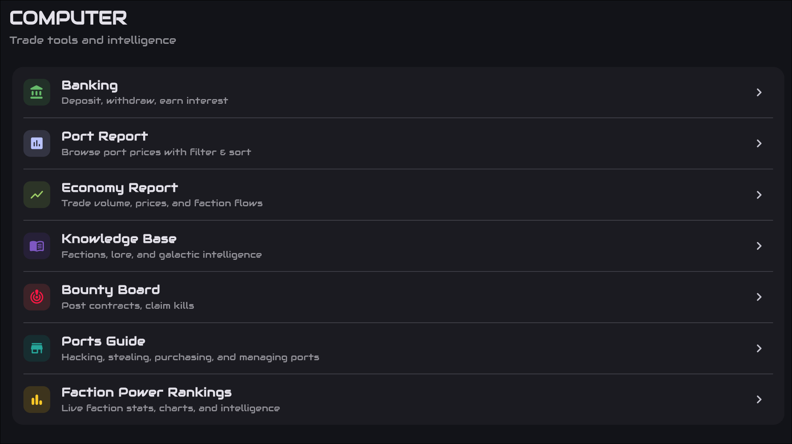
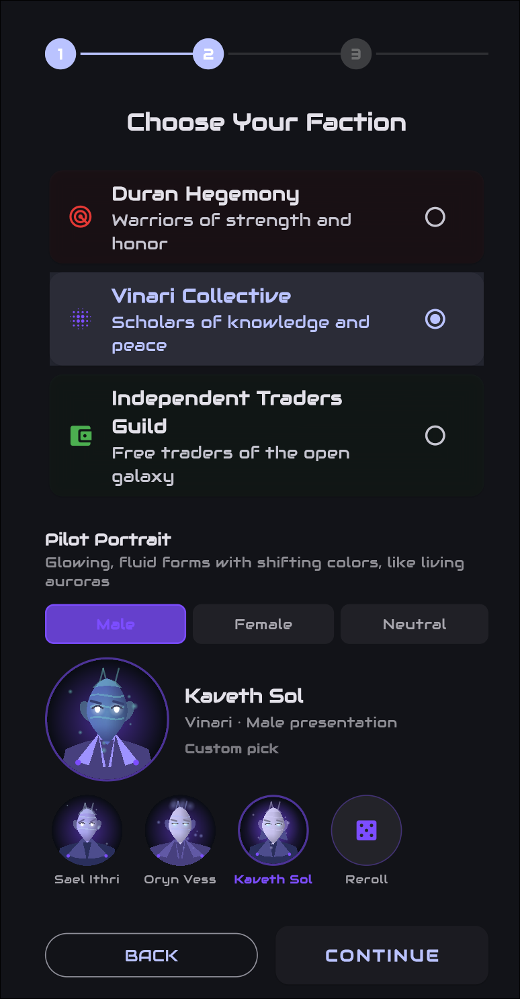
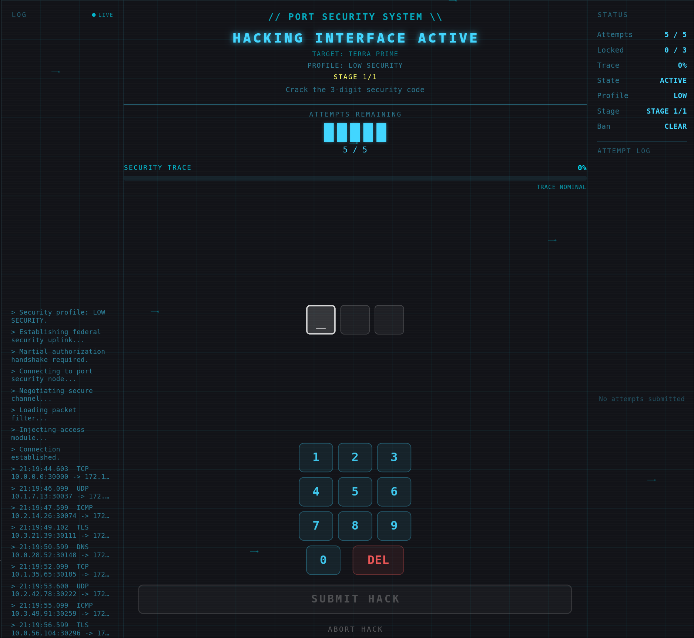
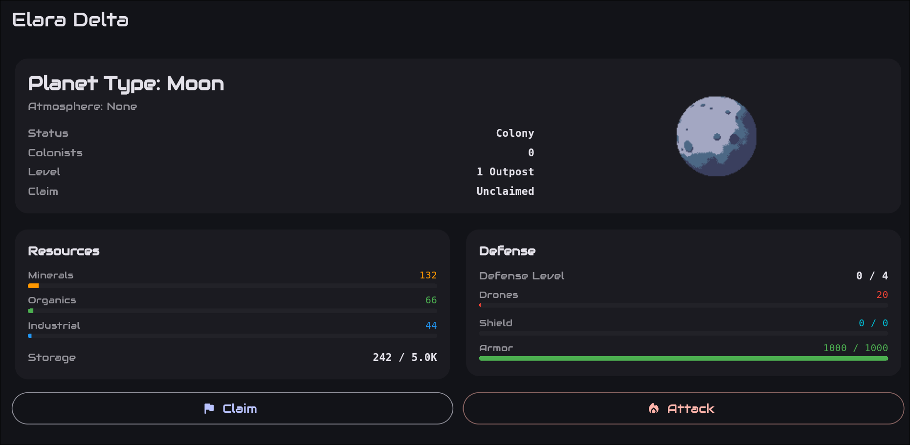
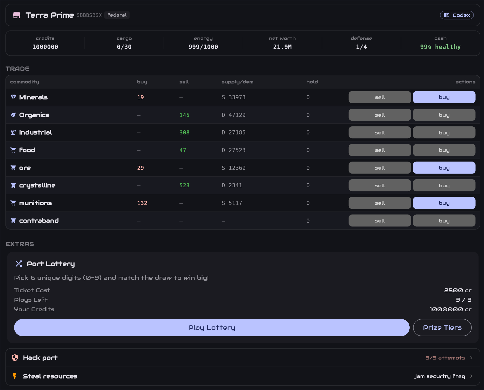
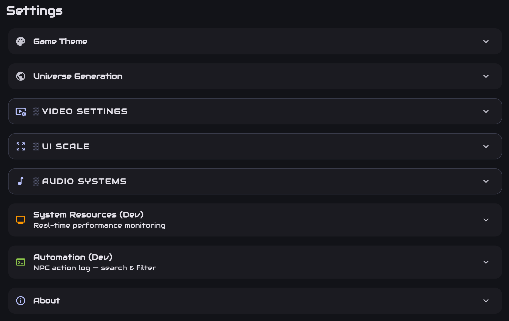

# Cosmic Trader

**Explore a living galaxy. Trade its markets. Build your reputation.**

Cosmic Trader is a space-trading and exploration game inspired by classic BBS-era adventures.
Pilot a ship through a procedurally generated galaxy, find profitable trade routes, outfit your
vessel, and decide how you want to make your mark among rival factions and independent traders.

> **In active development.** Cosmic Trader is playable, but some systems—especially planets and
> longer-term galaxy simulation—are still being expanded. Features and balance may change.

## Screenshots

These are current screenshots as of 09/27/2026, this may not be the final look and functionality. 
The game is still being worked on and tested, and I change look/feel as I play test Cosmic Trader.
If you have any recommendations for changes let me know.
<!-- Add screenshots here -->
<table>
  <tr>
    <td align="center">
      <a href="docs/screenshots/login_screen.png">
        
      </a>
    </td>
    <td align="center">
      <a href="docs/screenshots/main_screen.png">
        
      </a>
    </td>
  </tr>
  <tr>
    <td align="center">
      <a href="docs/screenshots/ship_view.png">
        
      </a>
    </td>
    <td align="center">
      <a href="docs/screenshots/computer_view.png">
        
      </a>
    </td>
  </tr>
  <tr>
    <td align="center">
      <a href="docs/screenshots/faction_pick_and_avatar.png">
        
      </a>
    </td>
    <td align="center">
      <a href="docs/screenshots/galaxy_map.png">
        
      </a>
    </td>
  </tr>
  <tr>
    <td align="center">
      <a href="docs/screenshots/hack_a_port.png">
        
      </a>
    </td>
    <td align="center">
      <a href="docs/screenshots/planet_view.png">
        
      </a>
    </td>
  </tr>
  <tr>
    <td align="center">
      <a href="docs/screenshots/port_view.png">
        
      </a>
    </td>
    <td align="center">
      <a href="docs/screenshots/settings_section.png">
        
      </a>
    </td>
  </tr>
</table>


## What you can do

- **Explore a new galaxy** — travel through connected sectors with ports, planets, hazards, and
  independently acting ships. Use the galaxy map, tactical sector view, and ship computer to plan
  your route. Choose a generation seed and universe settings if you want to shape the experience.
- **Trade across eight commodities** — compare local markets, manage cargo and credits, and watch
  supply, demand, market drift, regional effects, and faction standing influence prices. Contraband
  is available through black-market ports.
- **Manage energy and your ship** — warps and scans spend energy. Refuel at Hardware Emporiums,
  deploy a Solar Array for a slow recharge, or call an Emergency Tow if stranded. Choose from four
  ship classes at registration, then upgrade weapons, hull, shields, engines, and modules.
- **Meet the factions** — begin with the Duran Hegemony, Vinari Collective, or Independent Traders
  Guild. Pirates roam the galaxy as a hostile NPC faction. Your actions influence faction standing
  and notoriety, affecting prices, services, banking, and how other pilots treat you.
- **Face a living galaxy** — NPC pilots have distinct personalities, goals, and faces, and they
  keep the same face between sessions, so you can learn to recognise a ship before you know its
  name. They trade, bank, outfit ships, hunt bounties, hold borders, travel in convoys or pirate
  packs, and remember some encounters. Homeworlds and pirate outposts help factions recover and
  grow.
- **Fight, flee, or negotiate** — ship and port combat give you choices beyond trading. NPCs can
  break off or surrender; victory can bring credits, cargo, and salvage, while combat and bounties
  affect faction standing.
- **Use the Bounty Board** — post contracts, pursue wanted pilots, and collect rewards. Bounties
  expire, and eligible player deposits can be reclaimed if a contract lapses.
- **Buy and manage ports** — negotiate to acquire eligible ports, improve their defenses, adjust
  prices, and collect revenue.
- **Claim planets** — scan worlds, claim unowned planets, transfer resources and colonists, and
  develop colonies through Citadel levels. Homeworlds and backup worlds support faction
  repopulation; player colony automation and planetary invasions are still in progress.
- **Take a break from trading** — try the lottery, hack port security, or play the frequency-jamming
  mini-game.
- **Use your ship’s computer** — check port reports, rankings, faction lore, bounties, and economy
  activity.
- **Make your pilot your own** — pick a species and a starting look when you register, then tune
  the portrait axis by axis: build, face, hair, eyes, markings, expression, and backdrop. Colours
  are chosen separately from shapes, so a face is not limited to the three looks its silhouette
  implies. Each axis has its own reset, and you can lock the ones you have settled before
  re-rolling the rest. Change your look at any time from the Ship screen.
- **Make the interface yours** — adjust themes, fonts, audio, screen scale, and display density.
  Desktop UI scaling can adapt to large displays, with manual controls available in Settings.

Cosmic Trader is built with Flutter and targets Android, iOS, web, Linux, macOS, and Windows. Saves
are local to the device; browser persistence is still limited, and cloud saves and multiplayer are
not available.

## Getting started

### Try it from source

You’ll need Flutter with a bundled Dart SDK **3.6.2 or later**. Clone the repository, then run:

```bash
git clone https://github.com/darkoned12000/Cosmic-Trader.git
cd Cosmic-Trader
flutter pub get
flutter run
```

To choose a target explicitly:

```bash
flutter run -d linux       # Linux desktop
flutter run -d chrome      # Web
```

For Android or iOS, connect a device or start an emulator, then run `flutter run`.

### Your first trip

1. Create a local pilot account, choose a faction, a portrait, and a ship, then launch into the
   galaxy.
2. Check your sector for a port, nearby warp routes, and other ships.
3. Compare port prices, buy a commodity your ship can carry, then travel to a port that will buy it.
4. Keep an eye on energy and cargo space; refuel or upgrade at an Emporium when needed.
5. Use the galaxy map and Computer tools to plan your next move.

There are several ways to play: focus on trading and port ownership, explore and develop planets,
or outfit a combat-ready ship and take risks in hostile space.

## Factions

| Faction | Style |
|---|---|
| **Duran Hegemony** | A militaristic insectoid empire built around strength and conquest. |
| **Vinari Collective** | Luminous, semi-corporeal explorers who value knowledge and harmony. |
| **Independent Traders Guild** | Pragmatic Terran merchants who survive through opportunity and negotiation. |
| **Pirates** | Hostile raiders, pillagers, and hunters encountered across the galaxy. |

The first three are selectable when creating a pilot; Pirates are currently an NPC faction.

## Coming up

The roadmap is evolving alongside development. Current areas of work include:

- **Complete the planet loop** — automate player-colony production, connect colony output to nearby
  markets, and add planetary invasion gameplay.
- **More reasons to explore** — introduce missions, persistent galaxy events, and new ways to act
  on faction relationships.
- **More ship options** — add an in-galaxy shipyard and continue expanding ship content.
- **Raise the bar on pilot portraits** — portraits are generated in code rather than drawn as
  art, which gives near-endless variety at no asset cost but caps how good any one of them can
  look. Art quality is the open item, along with optional player-supplied images.
- **Ongoing polish and balance** — refine onboarding, combat and economy balance, and presentation.

These are plans, not release-date promises. See [`planets.md`](planets.md) for the current planet
system design and its implementation status, and [`player-avatar.md`](docs/player-avatar.md) for the
pilot-portrait system.

## Settings

The in-game Settings screen lets you adjust universe generation, commodity prices and quantities,
NPC population, themes, fonts, audio, and video options. Regenerating the universe can reset world
state, so review the regeneration options before confirming.

## Contributing and feedback

Cosmic Trader is an independent project in active development. Bug reports, gameplay ideas, and
contributions are welcome. For code contributions, please run:

```bash
flutter pub get
flutter analyze
flutter test
```

## License

License terms have not yet been added to the repository. Check back here for updates before
redistributing or incorporating the project.
